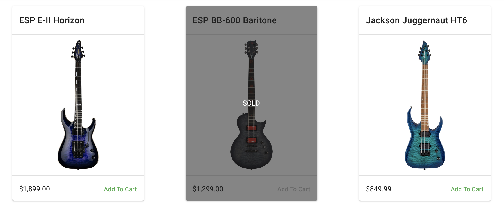

# Adding products in a catalogue with Nuxt.js and Commerce.js

This guide illustrates how to create and add products to your cart using Nuxt.

[Live Demo](https://commercejs-nuxt-demo.herokuapp.com/)

***** *Note* *****

* This guide uses v2 of the Commerce.js SDK



## Overview
The purpose of this guide is to help developers get familiar with using the Commerce.js SDK in conjunction with Nuxt.js. Commerce.js is a powerful eCommerce tool that gives you the ability to build custom eCommerce sites without the trouble of building out a lot of the complex functionality that comes with eCommerce projects. Commerce.js makes it easy for developers of all levels to build a fully customized online store. 

## Recap
If you followed the previous guide then you created a Nuxt application that utilizes 

## This guide will cover

1. (Optional) Creating variants of a product in your Chec Dashboard
2. Building a simple UI to accomodate a product cart
3. Manipulate your cart by adding and removing products

## Requirements

- IDE of your choice
- [Commerce.js SDK](https://github.com/chec/commerce.js)
- Yarn or npm
- [Nuxt.js](https://nuxtjs.org/)
- [Vuetify](https://vuetifyjs.com/en/)
- [Vuex](https://nuxtjs.org/guide/vuex-store/)

## Prerequisites
Basic knowldge of Nuxt.js and JavaScript are required for this guide, and some familiarity with Vuetify would help.

- Nuxt.js
- JavaScript(ES6)
- Vuetify.js

## Getting started

### (Optional) Product Variants

This step is optional but can be useful if you haven't gotten a chance to dive deeply into your dashboard yet. A variant in this context, would be a product that you offer that may have multiple options for purchase. For example; If you were selling a shirt, and the shirt came in various sizes or colors, you'd have more than one variant of that shirt that you may want to be available for purchase. Your Chec dashboard makes that easily available for you to customize.


### 2. Initializing a Nuxt project

To get started with Nuxt, I recommended checking out their [installation guide](https://nuxtjs.org/guide/installation/) and using the [create-nuxt-app](https://github.com/nuxt/create-nuxt-app) scaffolding tool to quickly spin up your project. Below I will list the options I chose when creating this guide.

```js
// npx: shipped by default since npm v5.2.0
npx create-nuxt-app <project-name>

// Yarn
yarn create nuxt-app <project-name>
```


### 3. Installing Commerce.js

Use the Commerce.js SDK to access the Chec API data from your application.

#### Installing via SDK

```js
// yarn
yarn add @chec/commerce.js

// npm
npm install --save @chec/commerce.js
```

### 4. Create a minimal [Nuxt plugin](https://nuxtjs.org/guide/plugins#inject-into-vue-instances) with the Commerce.js SDK

Create a new file in the plugins directory of your Nuxt app called `commerce.js`. You will begin this file by importing the Commerce.js SDK at the top of the file, followed by importing `Vue`. Next, inject the Commerce.js SDK with your API key into the `Vue` instance by setting a new property on the `Vue` instance called `$commerce`, which will allow you to access the Commerce.js SDK through Vue's instance globally. Once you've done this, all [features](https://commercejs.com/docs/overview/getting-started.html#features) of Commerce.js will be accessible on your `Vue` instance. Don't forget to add your new plugin's path to the plugins property located in the `nuxt.config.js` file of your project root so that Nuxt can inject it when building.


```js
// plugins/commerce.js
import Commerce from '@chec/commerce.js'
import Vue from 'vue'

Vue.prototype.$commerce = new Commerce(process.env.COMMERCEJS_API_KEY, true)

```

```js
// nuxt.config.js
module.exports = {
    // ...
    css: [],
    plugins: ['~/plugins/commerce.js'],
    buildModules: [],
    // ...
}

```

### 5. Create a file in your store directory called `index.js`

In your newly created `store/index.js` file you'll import `Vue` so that you can utilize your new plugin that has been injected into the `Vue` instance. Once this is done, create your Vuex store's state, which will contain an empty array of products by default. Next, you will create your store's actions, which will contain a special action specific to Nuxt.js - [nuxtServerInit()](https://nuxtjs.org/guide/vuex-store/#the-nuxtserverinit-action): This action gets called and fills your store with data on the server-side before rendering. This action is asynchronous and will wait for the list of products to be returned from the Chec API. Upon returned results, the action will commit the product data by calling the `setProducts` mutation and passing `products.data`, setting your state's products to the returned products list. The last little piece for the store is to write a getter that simply returns the state's list of products when called from your component. 

```js
// store/index.js
import Vue from 'vue'

export const state = () => ({
  products: []
})

export const actions = {
  async nuxtServerInit({ commit }) {
    const products = await Vue.prototype.$commerce.products.list()

    // Pass products.data 
    commit('setProducts', products.data)
  }
}

export const mutations = {
  setProducts(state, payload) {
    state.products = payload
  }
}

export const getters = {
  products() {
    return state.products
  }
}
```

### 6. Create a `CommerceItem.vue` component file under your components directory.

The `components/CommerceItem.vue` component will be used as a dynamic template to display the data for each item in your products list. First, create your script tag that exports a `name` and the `props` of your Vue component. Your component's `props` will contain a `product` object where you will explicitly set it's type and default key/value property pairs. Next, create a basic template that contains some Vuetify components that can be used as a starting point to style and render each individual product's data.

```js
// components/CommerceItem.vue
<template>
  <v-card max-width="300">
    <v-card-title>
      {{ product.name }}
    </v-card-title>

    <v-divider class="mb-3"></v-divider>

    <v-img :src="product.media.source" />

    <v-divider class="mt-3 mb-1"></v-divider>

    <v-card-action>
      <span>${{ product.price.formatted }}</span>
    </v-card-action>
  </v-card>
</template>

<script>
export default {
  name: 'CommerceItem',
  props: {
    product: {
      type: Object,
      default: () => ({
        id: '',
        media: null,
        name: '',
        price: ''
      })
    }
  }
}
<script>
```

### 7. Use the `CommerceItem.vue` component and Vuex's mapGetters to display your product list.

Inside your pages directory should live an `index.vue` file, if you used **create-nuxt-app** then you'll want to delete all the default filler code provided by the CLI. Inside of the component's script tag import the `mapState` function, followed by the `CommerceItem.vue` component and be sure to add `CommerceItem` to the `components` property of `components/index.vue`. 

Next, we will utilize the `...mapGetters` function inside of the component's `computed()` properties, and use the `products` getter to return your products in state. Finally, create a simple template that uses Vue's `v-for` directive to dynamically render each of your store's products.

```js
// pages/index.vue
<template>
  <v-layout column justify-center align-center>
    <v-flex xs12 sm8 md6>
      <v-row>
        <template v-for="product in products">
          <v-col :key="product.id">
            <commerce-item :key="product.id" :product="product" />
          </v-col>
        </template>
      </v-row>
    </v-flex>
  </v-layout>
<template>

<script>
import { mapState } from 'vuex'
import CommerceItem from '~/components/CommerceItem'

export default {
  components: {
    CommerceItem
  },
  computed: {
    ...mapGetters({ products: 'products' })
  }
}
</script>
```

### 8. Run your app!

You should now be able to run your Nuxt application and see the products from your store display.

```js
// yarn
yarn dev

//npm
npm run dev
```

[Live Demo](https://commercejs-nuxt-demo.herokuapp.com/)

## Conclusion
Nice work, you've successfully listed your products out using Nuxt.js.

Let's review what we have accommplished in this guide.

* Created a Chec account and added products
* Initialized a Nuxt application
* Injected a simple Vue plugin utilizing Commerce.js SDK
* Created a simple Vuex store and rendered your data server-side using nuxtServerInit()
* Listed your products in your Nuxt application

## Built With

* [Nuxt.js](https://github.com/nuxt/nuxt.js) - The front-end framework used
* [Vuetify](https://github.com/vuetifyjs/vuetify) - The Vue material component library used
* [Yarn](https://github.com/yarnpkg/yarn) - Package manager tool

## Authors

* **ElijahKotyluk** - [Github](https://github.com/ElijahKotyluk)

